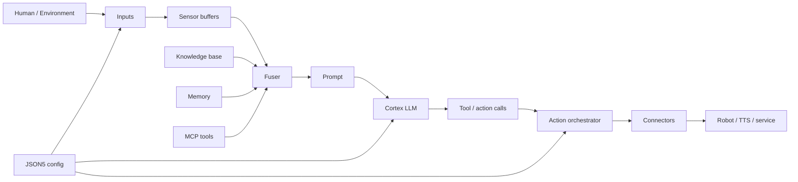
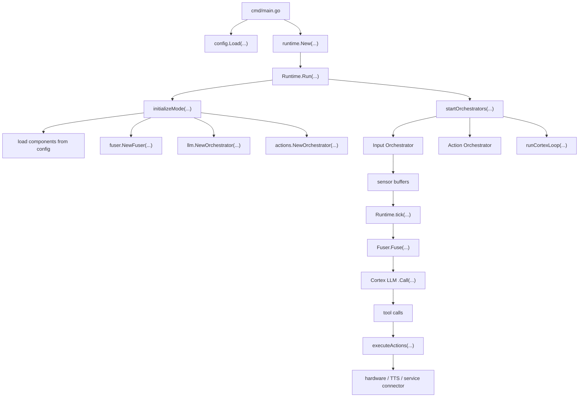
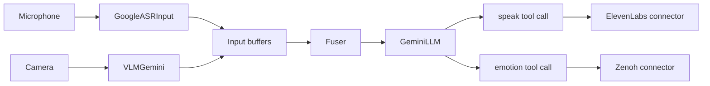
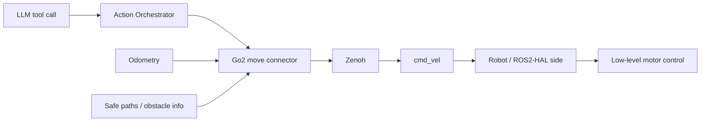

# OM1 Study Fork — Start Here

This fork is a **learning copy** of OpenMind's OM1 runtime.

The goal is not to read every file. The goal is to understand the system from the top down, then descend one layer at a time until the code stops looking mysterious.

## The 30-second mental model

OM1 is a configurable agent runtime:



In plain English:

1. A config file says which sensors, model, actions, and behaviors exist.
2. Input plugins listen to things such as microphone, camera, localization, or robot state.
3. OM1 keeps the latest useful sensor state in buffers.
4. The **Fuser** turns persona + sensor state + memory + knowledge + available actions into one LLM prompt.
5. The **Cortex LLM** reasons over that prompt and may return tool/action calls.
6. The **Action Orchestrator** routes those calls to concrete connectors.
7. A connector does something real: speak, publish a robot velocity command, call a service, etc.
8. The loop repeats.

That is the core architecture to keep in your head while reading the code.

---

# Where execution actually starts

The Go process starts here:

> **`cmd/main.go`**

Then the important chain is:



If you are lost anywhere in the repository, come back to this graph.

---

# Recommended reading order

Do **not** browse alphabetically.

## Pass 1 — understand the skeleton

Read in this order:

1. **This file**
2. [Go Starter Pack](study/01_GO_STARTER_PACK.md)
3. [OM1 Code Map](study/02_OM1_CODE_MAP.md)
4. [Annotated `cmd/main.go`](study/annotated/01_CMD_MAIN.md)
5. [Runtime / Cortex Loop Walkthrough](study/03_RUNTIME_WALKTHROUGH.md)
6. [Annotated Cortex Tick](study/annotated/02_RUNTIME_TICK.md)

At that point you should be able to answer:

> "When OM1 receives an input, how does that eventually become a physical action?"

## Pass 2 — understand extensibility

7. [Plugins and Robot Flow](study/04_PLUGIN_AND_ROBOT_FLOW.md)
8. `internal/inputs/sensor.go`
9. `internal/actions/action.go`
10. `plugins/inputs/vlm/vlm_gemini.go`
11. `plugins/llm/gemini.go`
12. `plugins/actions/unitree/go2/autonomy/move.go`

At that point you should understand why OM1 can swap:
- sensor types
- LLM providers
- robot hardware/action connectors

without rewriting the central runtime.

## Pass 3 — robotics / FDE-relevant files

After the software architecture is comfortable, focus on:

- `internal/zenoh/`
- `plugins/inputs/localization.go`
- `plugins/actions/navigation/`
- `plugins/actions/unitree/go2/autonomy/`
- `docs/full_autonomy_guidelines/architecture_overview.md`
- `docs/full_autonomy_guidelines/localization.md`
- `docs/developing/ros2-humble.md`
- `docs/developing/zenoh-bridge.md`

These connect directly to field-deployment concepts: ROS2, localization, navigation, Zenoh, robot command paths, and debugging.

---

# The repository by responsibility

```text
om1/
├── cmd/
│   └── main.go                 <- PROCESS ENTRY POINT
│
├── config/
│   └── *.json5                 <- CHOOSE AN AGENT: inputs, LLM, actions, prompts
│
├── internal/                   <- CORE RUNTIME IMPLEMENTATION
│   ├── runtime/                <- lifecycle + cortex loop + modes
│   ├── inputs/                 <- Sensor abstraction + input orchestration
│   ├── fuser/                  <- builds the prompt/context
│   ├── llm/                    <- model abstraction + conversation orchestration
│   ├── actions/                <- action abstraction + execution orchestration
│   ├── providers/              <- shared runtime state/services/providers
│   ├── memory/                 <- long-term memory integration
│   ├── knowledgebase/          <- RAG / KB access
│   ├── mcp/                    <- MCP tool integration
│   ├── zenoh/                  <- Zenoh session abstraction
│   ├── metrics/                <- Prometheus metrics
│   ├── tracer/                 <- trace / quality scoring
│   └── ...
│
├── plugins/                    <- CONCRETE IMPLEMENTATIONS
│   ├── inputs/                 <- ASR, VLM, localization, robot inputs
│   ├── llm/                    <- Gemini, OpenAI-compatible, Ollama, etc.
│   ├── actions/                <- speech, navigation, Unitree movement, etc.
│   └── backgrounds/
│
├── docs/                       <- OpenMind's documentation
├── grafana/                    <- monitoring dashboards
├── docker-compose.yml          <- supporting observability services
├── Makefile                    <- common build/run commands
├── go.mod                      <- Go module + dependencies
└── README.md                   <- upstream project overview
```

### One distinction worth memorizing

**`internal/` contains the machinery.**  
**`plugins/` contains interchangeable implementations plugged into that machinery.**

Python analogy:

- `internal/inputs.Sensor` is like an abstract/protocol-style base contract.
- `GoogleASRSensor` is one concrete implementation.
- The registry is like a dictionary mapping a string name to a constructor.
- The JSON5 config chooses which implementation gets instantiated.

---

# A concrete example: the conversation agent

Open:

> `config/conversation.json5`

It declares, among other things:

- `GoogleASRInput`
- `VLMGemini`
- `GeminiLLM`
- a `speak` action using ElevenLabs TTS
- an `emotion` action using Zenoh

Conceptually:



The config is not just parameters. It is effectively **wiring together an agent**.

---

# A concrete robot example: Unitree Go2 movement

The upstream README points to:

> `plugins/actions/unitree/go2/autonomy/move.go`

That connector registers an action called:

> `unitree_go2_autonomy/move`

The LLM can choose a high-level movement such as "move forwards" or "turn left".

The connector then uses robot state and safe-path information and publishes velocity commands via Zenoh to a `cmd_vel` key/topic.



This is a great file for interview preparation because it crosses:
- AI decision-making
- Go
- concurrency
- state
- safety checks
- odometry
- path selection
- middleware
- physical robot commands

---

# What OM1 is NOT doing

A useful FDE distinction:

OM1 generally assumes a robot already has a suitable **hardware abstraction layer / SDK** capable of accepting meaningful high-level commands.

OM1 is not normally replacing:
- motor firmware
- servo control loops
- low-level battery/thermal control
- raw joint stabilization
- all ROS2 navigation/perception components

Instead, OM1 sits above or beside those layers and integrates with them.

A useful mental stack:

```text
OM1 agent reasoning / actions
        ↓
Zenoh / ROS2 / DDS / HTTP / WebSocket interfaces
        ↓
robot HAL / navigation stack / SDK
        ↓
drivers + embedded controllers
        ↓
firmware
        ↓
motors / sensors / physical robot
```

---

# What to know for an OpenMind FDE interview

Do not try to memorize the repository.

Be able to explain:

1. **Where does OM1 start?**  
   `cmd/main.go`, then `runtime.Run`.

2. **How does configuration become behavior?**  
   JSON5 selects registered input/LLM/action plugins and runtime options.

3. **How does sensor input reach the model?**  
   sensors → input orchestrator → latest buffers → fuser → prompt.

4. **How does the model control a robot?**  
   tool call → action orchestrator → connector → middleware/HAL.

5. **Where is concurrency?**  
   inputs, action connector tick loops, backgrounds, cortex loop, and transitions run with goroutines/channels/context cancellation.

6. **Why Go?**  
   OM1's README emphasizes lower latency, efficient concurrency, memory footprint, and simple binary deployment.

7. **Where would you debug?**  
   First decide which boundary is failing:
   input → context → model → tool call → connector → middleware → HAL → hardware.

That last point is the FDE mindset.

---

# Your first study exercise

Without looking at any other file, try to explain this sentence aloud:

> "A JSON5 config chooses sensor, model, and action plugins; the runtime starts their orchestrators; sensor state is fused into a prompt; the LLM returns structured action calls; and action connectors translate those calls into real software or robot behavior."

If you can explain each clause, you already understand the architecture at a useful interview level.

Then open:

> **[Go Starter Pack](study/01_GO_STARTER_PACK.md)**
