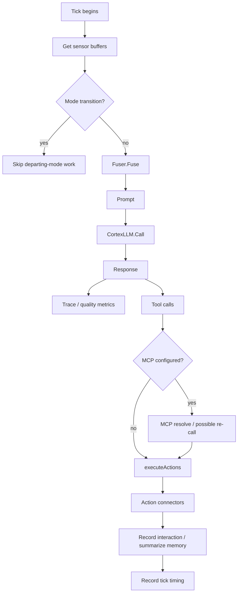

# OM1 Runtime Walkthrough — From Process Start to Robot Action

The goal of this chapter is to understand the **control flow**, not every helper function.

---

# Phase 1: process boot

Entry:

```text
cmd/main.go
```

It loads configuration and constructs:

```go
rt := runtime.New(cfg, log, runtime.Options{...})
```

Then:

```go
rt.Run(ctx)
```

The `ctx` can be canceled by SIGINT/SIGTERM so the system can shut down gracefully.

---

# Phase 2: Runtime.New

`runtime.New` creates the central Runtime object.

Important fields include:

```text
systemConfig
manager
ioProvider
tracer
current mode state
mode-transition channel
global backgrounds
```

It also configures default Zenoh options from system config.

Mental model:

> construct the control plane, but do not start all workers yet.

---

# Phase 3: Runtime.Run

`Run` coordinates startup.

High-level:

```text
optional config watcher
      ↓
load global backgrounds
      ↓
find initial mode
      ↓
initializeMode(initialMode)
      ↓
run startup hooks
      ↓
startOrchestrators
      ↓
start global backgrounds
      ↓
start tracer
      ↓
wait until shutdown
      ↓
stop everything cleanly
```

The runtime uses **contexts + goroutines + done channels** to manage concurrent components.

---

# Phase 4: initializeMode

This is where a configured mode becomes actual objects.

Conceptual translation:

```text
mode JSON/config
      ↓
load concrete sensors
load concrete LLM
load concrete actions
load backgrounds
load MCP if configured
      ↓
construct Fuser
construct Cortex LLM Orchestrator
construct Action Orchestrator
      ↓
save them in modeState
```

The resulting `modeState` contains the pieces needed to run one agent mode.

Important fields:

```go
promptFuser
cortexLLM
actionOrchestrator
sensors
inputOrchestrator
mcpOrchestrator
bgOrchestrator
memory
```

Python-ish mental model:

```python
state = ModeState(
    fuser=Fuser(...),
    llm=CortexOrchestrator(...),
    actions=ActionOrchestrator(...),
    sensors=sensors,
    ...
)
```

---

# Phase 5: startOrchestrators

This launches the concurrent runtime components.

### Input side

```go
current.inputOrchestrator = inputs.NewOrchestrator(current.sensors, rt.log)
current.inputDone = current.inputOrchestrator.Start(modeCtx)
```

Inside InputOrchestrator:

> one goroutine is started per sensor.

For example:
- microphone loop can listen continuously
- camera/VLM can run independently
- robot status can update independently

### Actions

The action orchestrator starts a Tick loop for each action connector.

### Backgrounds

Background workers run separately.

### Cortex

The reasoning loop is launched in a goroutine:

```go
go func() {
    rt.runCortexLoop(modeCtx)
}()
```

So OM1 is not one sequential script.

It is a set of concurrent workers coordinated by contexts, channels, buffers, and orchestrators.

---

# Phase 6: runCortexLoop

This is the repeating "brain cycle".

The loop computes an interval from:

```text
runtimeConfig.Hertz
```

Then each cycle can be triggered by:

1. the regular timer
2. an input sensor saying "new important input arrived"
3. a mode-context update

This is implemented using Go's `select`.

Conceptually:

```text
WAIT FOR:
- shutdown
- timer
- new input
- mode state/context update

THEN:
- maybe transition modes
- otherwise tick()
```

---

# Phase 7: tick — the heart of OM1

The comment in the source is accurate:

> "tick executes a single cortex cycle: checks for mode transitions, fuses a prompt, calls the LLM, executes tool calls and records telemetry."

This is the most important function to understand.



---

# Phase 8: Fuser.Fuse

The Fuser takes multiple sources and creates **one model context**.

Exact order currently includes:

1. system persona
2. governance rules
3. current timestamp
4. sensor observations
5. knowledge-base results
6. long-term memory
7. available action descriptions
8. MCP tool descriptions
9. examples
10. closing prompt: "What will you do next?"

This is essentially OM1's **context engineering layer**.

An important debugging question:

> Did the information I expected actually enter the fused prompt?

A perfectly functioning model cannot reason from state it never received.

---

# Phase 9: Cortex LLM call

`internal/llm/orchestrator.go` wraps the underlying model.

It manages:
- conversation history
- history length
- function/tool schemas
- synchronization around shared history

The concrete LLM might be Gemini, Ollama, etc.

The runtime does not need to care about the provider details because it works through the common LLM interface.

This is polymorphism through Go interfaces/registries.

---

# Phase 10: tool calls → actions

The LLM response can include ToolCalls.

The runtime passes these into:

```text
executeActions
  ↓
ActionOrchestrator.ParseCalls
  ↓
ActionOrchestrator.Submit
  ↓
AgentAction.Connector.Connect
```

The action orchestrator can execute:
- concurrently
- sequentially
- based on declared dependencies

That means one model response could potentially trigger multiple actions with controlled execution semantics.

---

# Phase 11: concrete connector

Example:

```text
unitree_go2_autonomy/move
```

The connector receives arguments such as:

```json
{"action": "move forwards"}
```

Then the connector—not the generic runtime—knows how to implement that on this robot.

That is an important separation:

```text
Runtime:
"What action did the model choose?"

Connector:
"How does THIS hardware perform that action?"
```

---

# Phase 12: robot middleware

The Go2 move connector opens Zenoh and publishes robot commands.

From there, the complete deployment may include a ROS2/Zenoh bridge and robot HAL/navigation services.

So the full path may look like:

```text
OM1 LLM
  ↓
tool call
  ↓
Go action connector
  ↓
Zenoh
  ↓
ROS2 bridge / robot autonomy stack
  ↓
cmd_vel
  ↓
robot HAL / motor controller
  ↓
physical motion
```

The exact lower path depends on the deployment.

---

# FDE debugging interpretation

Suppose the model says "move forward" but the robot stays still.

Do **not** immediately blame the LLM.

Walk the boundaries:

### Cognition
- Did input state reach the Fuser?
- Was "move forwards" exposed as a valid action?
- Did LLM response contain the expected tool call?

### OM1 action path
- Did `ParseCalls` find the action?
- Did the connector's `Connect` execute?
- Did it reject the command because robot already moving, unsafe path, missing odometry, disabled AI control, guard mode, etc.?

### Middleware
- Was Zenoh session open?
- Was publisher declared?
- Was `cmd_vel` data sent?

### Lower robotics stack
- Did Zenoh bridge receive it?
- Did ROS2 topic update?
- Did navigation/controller accept it?
- Did motor/HAL produce feedback?

That is the reasoning habit this codebase can teach you.

---

# What you should be able to say aloud

After this chapter:

> "OM1 is built as concurrent orchestrators around a central cortex loop. Sensors continuously update buffers. On each cortex tick, the Fuser assembles context, the configured LLM returns text and/or structured tool calls, and the action orchestrator dispatches those calls to hardware-specific or service-specific connectors."

That is a strong high-level answer.
