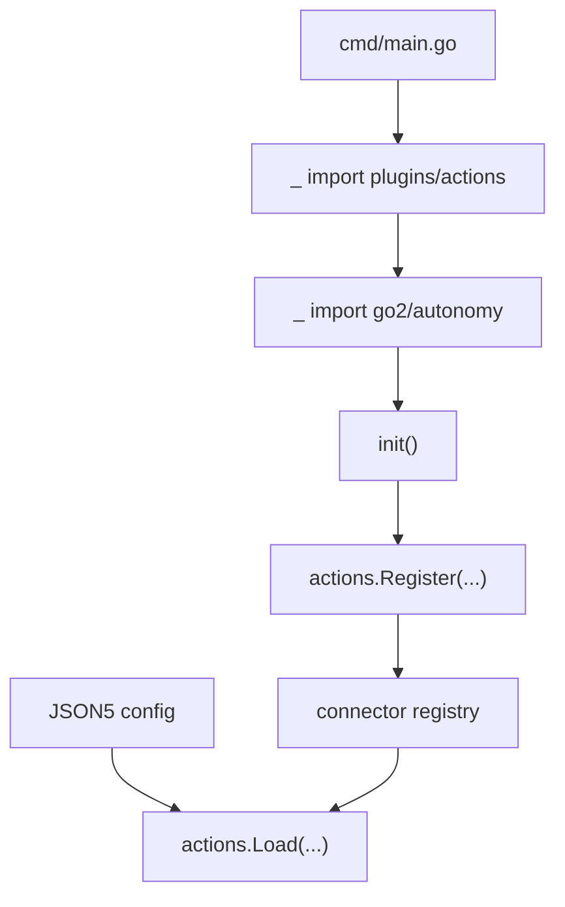
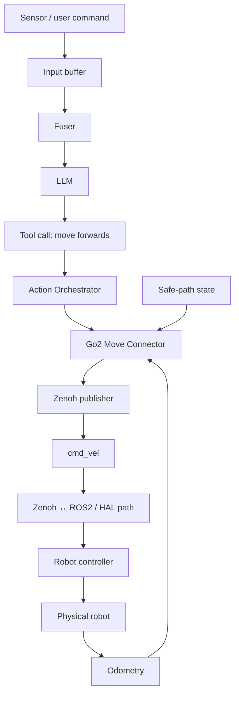

# OM1 Plugins and Robot Flow — How Configuration Becomes Hardware Behavior

This chapter explains OM1's plugin pattern and follows one robot action toward the physical system.

---

# Part 1 — why registries exist

OM1 wants config like this to work:

```json5
cortex_llm: {
  type: "GeminiLLM"
}
```

But a string such as `"GeminiLLM"` cannot magically instantiate Go code.

OM1 solves this with registries.

---

# Part 2 — registering a concrete plugin

From:

> `plugins/llm/gemini.go`

```go
func init() {
    llm.Register("GeminiLLM", NewGemini)
}
```

Meaning:

> When this Go package loads, put the constructor `NewGemini` in the LLM registry under the key `GeminiLLM`.

Python-ish equivalent:

```python
LLM_REGISTRY["GeminiLLM"] = NewGemini
```

Then config can select it by name.

---

# Part 3 — why the weird blank imports exist

From `cmd/main.go`:

```go
_ "github.com/openmind/om1/plugins/actions"
_ "github.com/openmind/om1/plugins/backgrounds"
_ "github.com/openmind/om1/plugins/inputs"
_ "github.com/openmind/om1/plugins/llm"
```

These imports are not unused mistakes.

They intentionally cause the plugin packages to load.

For actions, `plugins/actions/actions.go` itself blank-imports concrete packages such as:

```text
emotion
navigation
speak
Unitree G1 arm
Unitree Go2 autonomy
Unitree Go2 location
...
```

Loading those packages triggers their `init()` registrations.

Graph:



---

# Part 4 — input example: camera VLM

From:

> `plugins/inputs/vlm/vlm_gemini.go`

```go
func init() {
    inputs.Register("VLMGemini", NewVLMGemini)
}
```

Config:

```json5
{
  type: "VLMGemini"
}
```

At startup, runtime configuration loading resolves that name to the registered constructor.

The result satisfies:

> `internal/inputs.Sensor`

So the generic InputOrchestrator can operate it without knowing it is Gemini, a camera, or a VLM.

This is classic dependency inversion / plugin architecture.

---

# Part 5 — input example: ASR is more involved

Google ASR:

> `plugins/inputs/asr/google_asr.go`

Registers:

```go
inputs.Register("GoogleASRInput", NewGoogleASR)
```

The concrete sensor:
- opens microphone input through PortAudio
- streams audio
- handles ASR WebSocket interaction
- emits processed transcript state
- supports TTS interruption rules
- records latency metrics

Yet the core runtime only sees:

> a Sensor.

That separation is the point.

---

# Part 6 — action interface vs action connector

This terminology matters.

An **action** is the semantic capability exposed to the LLM.

A **connector** is the concrete implementation for a platform/system.

Example:

```text
semantic capability:
    "move"

implementation:
    Unitree Go2 autonomy connector
```

The action layer lets OM1 reason in meaningful terms rather than directly generating arbitrary motor packets.

---

# Part 7 — Go2 movement registration

From:

> `plugins/actions/unitree/go2/autonomy/move.go`

The package registers both an interface description and connector:

```go
actions.RegisterInterface(
    "unitree_go2_autonomy",
    "...",
    MoveInput{},
)

actions.Register(
    "unitree_go2_autonomy/move",
    NewMoveConnector,
)
```

`MoveInput` contains:

```go
type MoveInput struct {
    Action MoveAction `json:"action" ...`
}
```

and valid values include:
- turn left
- turn right
- move forwards
- move back
- stand still

This schema can be exposed to the model as a structured callable action.

---

# Part 8 — creating the connector

`NewMoveConnector` creates runtime state including:

- logger
- odometry provider
- safe-path provider
- Zenoh session
- `cmd_vel` publisher
- AI control status publisher/subscriber
- optional guard watcher
- mutex-protected pending command state

This is a good demonstration of why FDEs need systems breadth: one "move" action touches AI, middleware, localization/odometry, obstacle state, concurrency, and hardware integration.

---

# Part 9 — command safety gates

Before moving, `Connect` checks conditions such as:
- guard-mode constraints
- AI control enabled
- robot already moving
- another movement command already pending
- odometry availability/state
- safe paths / command feasibility

So:

> "The LLM asked to move" does not necessarily mean "the connector will publish movement."

That is a valuable debugging distinction.

---

# Part 10 — `cmd_vel`

The connector uses a default key/topic:

```text
cmd_vel
```

This name should look familiar from ROS robotics.

A velocity command commonly encodes:
- linear velocity
- angular velocity

The connector publishes movement data through Zenoh.

The complete deployment can bridge Zenoh into the ROS2 ecosystem / HAL.

---

# End-to-end movement flow



This is a closed loop in the broader system because physical robot state feeds perception/odometry back into software.

---

# How an FDE should debug this flow

Suppose no movement occurs.

### 1. Verify intent
Did the input correctly represent the human/environment request?

### 2. Verify context
Did the Fuser include the relevant current robot state?

### 3. Verify model output
Did the LLM produce the expected movement tool call?

### 4. Verify action routing
Did the Action Orchestrator map the call to the right AgentAction?

### 5. Verify connector safety checks
Did `Connect` intentionally reject the command?

### 6. Verify middleware
Is Zenoh connected? Was `cmd_vel` published?

### 7. Verify bridge / ROS2
Did the lower robotics stack receive the message?

### 8. Verify controller / HAL
Was the command accepted and translated?

### 9. Verify hardware feedback
Did the motors move? Did odometry change?

This is much more useful than "restart everything."

---

# A useful architectural insight

The core runtime is intentionally relatively hardware-agnostic.

The hardware specificity lives near the edge:
- input plugins
- action connectors
- middleware/HAL adapters

This is why the same agent architecture can target different physical robots.

---

# Next code to read

After this chapter:

1. `plugins/inputs/vlm/vlm_gemini.go` — tiny, easy registry example
2. `plugins/llm/gemini.go` — tiny, easy LLM provider example
3. `internal/actions/action.go` — connector abstraction
4. `plugins/actions/unitree/go2/autonomy/move.go` — real physical-system connector
